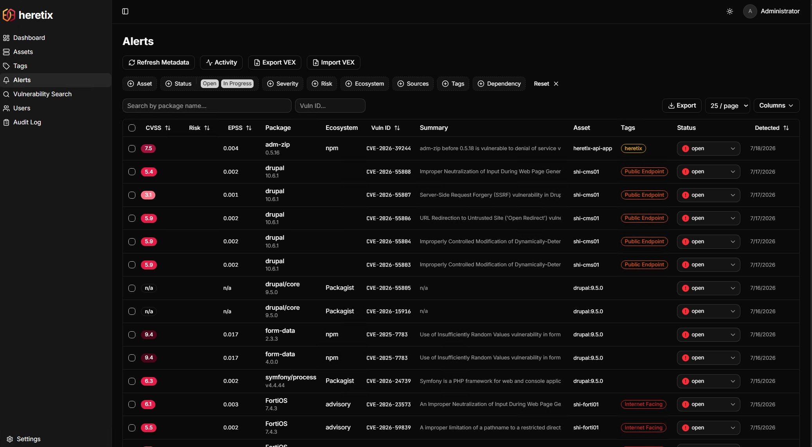

# heretix-management

heretix-management is the web console of **[heretix](https://titeee.github.io/heretix-web/)**, a self-hosted suite that tracks CVEs across servers, containers and network appliances (firewalls, VPNs) in one inventory (Apache-2.0).

[日本語版 README](README.ja.md)



## What it does

It keeps the inventory of what you run and the vulnerabilities found in it, and gives you one place to triage them:

1. **Import** what each asset has installed: an SBOM from heretix-cli, Trivy or Syft, a CSV of appliances, or packages added by hand.
2. **Scan** the inventory against heretix-api, which turns matches into alerts, keeps them current, and resolves the ones that no longer apply.
3. **Triage**: track each alert from open to resolved or ignored, with SLA due dates, CISA KEV and EPSS signals, the distro's own rating and fix status, VEX exchange, and Slack notifications.

Where it sits in heretix:

```
 servers / containers                 network appliances
        │ heretix-cli, Trivy, Syft          │ added by hand / CSV
        ▼                                   ▼
 heretix-management (inventory + alerts) ── search ──► heretix-api (vulnerability data)
        │
        ▼
 dashboard, alerts, VEX, Slack
```

- **[heretix-cli](https://github.com/TITeee/heretix-cli)** collects the packages on a host or image as a CycloneDX SBOM.
- **heretix-management** (this repository) keeps the inventory and the findings.
- **[heretix-api](https://github.com/TITeee/heretix-api)** answers "is this version vulnerable?" from its local copy of OSV, NVD, KEV, EPSS, and vendor advisories.

## Features

- **Inventory**: import SBOMs (heretix-cli, Trivy, Syft, cdxgen) incrementally, register appliances by hand or by CSV, keep a per-asset package change history, and view each asset's dependency graph *(Beta)*
- **Detection**: scan on demand, from CI with an access token, or on a daily schedule, including malicious packages (`MAL-*`)
- **Alerts**: statuses, filters, bulk updates, CSV / JSON export, a timeline per alert, and a detail panel with NVD, OSV, vendor advisory, and CVE Record data
- **Prioritization**: severity counted the same way on every screen, SLA due dates by severity with a shorter one for actively exploited (CISA KEV) vulnerabilities, exploit likelihood (EPSS), the distro's own rating (Ubuntu priority, Debian urgency, Red Hat impact), and whether the vendor will fix it ("will not fix", "fix deferred")
- **VEX** *(Beta)*: export ignored alerts as CycloneDX VEX, import VEX documents, and reuse judgments made on other assets
- **Tags**: group assets and packages (e.g. "Internet Facing") and see severity per tag
- **Notifications and AI**: Slack notifications filtered by severity and tags, and an optional AI Insight chat per alert (Anthropic)
- **Administration**: users and roles, an audit log, and Settings for heretix-api, Slack, AI, SLA, and access tokens

## Requirements

| | Requirement |
|---|---|
| heretix-api | A running [heretix-api](https://github.com/TITeee/heretix-api) **with its data loaded** (its quick start, step 3), and its API key. heretix-management has no vulnerability data of its own: every scan asks heretix-api |
| Sizing | heretix-management itself is light. Size the server for heretix-api, whose database accounts for most of it: see the [heretix requirements](https://titeee.github.io/heretix-web/docs/) and heretix-api's README (figures cover both, for a PoC: 2 vCPU, 8 GB RAM, 20 GB disk) |
| Software | Docker and Docker Compose v2, and git |
| Network | heretix-management must reach heretix-api's port (5000 by default); users reach port 3000 |

To run without Docker (Node.js 22, pnpm, PostgreSQL 15+), see [docs/operations.md](docs/operations.md#running-without-docker).

## Quick start

### 0. Set up heretix-api first

Follow [heretix-api's quick start](https://github.com/TITeee/heretix-api#quick-start) through its step 3 (loading data), and note its `API_KEY`. Its first full NVD import takes several hours, but you can carry on here meanwhile: scans just find more once it finishes.

### 1. Get the code and configure it

```bash
git clone https://github.com/TITeee/heretix-management.git
cd heretix-management
cp .env.example .env
```

Edit `.env` and set:
- `AUTH_SECRET`: a random secret for signing sessions (`openssl rand -base64 32`).
- `AUTH_URL`: the URL users will open, e.g. `http://192.0.2.10:3000`. Sign-in redirects go here, so it must not be `localhost` unless you only use the server's own browser.
- `HERETIX_API_KEY`: the `API_KEY` from heretix-api's `.env`.
- `POSTGRES_PASSWORD`: the password of the bundled database. Change it: the default, `changeme`, is only for a local trial.

heretix-api's URL defaults to `http://host.docker.internal:5000`, which reaches a heretix-api on the same server from inside the container. Set `HERETIX_API_URL` only if heretix-api runs elsewhere. The URL and key can also be changed later on the Settings page.

### 2. Start it

```bash
docker compose up --build -d
docker compose ps                                          # db and app are both up
curl -s -o /dev/null -w "%{http_code}\n" localhost:3000/login   # → 200
```

On first start, the container creates the database schema and then starts the console on port 3000. Logs: `docker compose logs -f app`.

### 3. Create the admin user

```bash
docker compose exec app node_modules/.bin/tsx prisma/seed.ts
```

This creates `admin@example.com` / `changeme` (set `SEED_EMAIL` and `SEED_PASSWORD` to choose your own) and the default tags. Sign in at your `AUTH_URL`, then change the password on the **Users** page.

### 4. Connect to heretix-api

Open **Settings → Vulnerability API**, check the URL and key, and press **Test Connection**. If it fails: check that heretix-api answers (`curl http://localhost:5000/health` on its server), that the key matches its `API_KEY`, and, with heretix-api on another server, that `HERETIX_API_URL` points there and port 5000 is reachable. A URL with `localhost` never works from inside the container.

### 5. Import and scan your first asset

Create an SBOM of something you run, with either tool:

```bash
# heretix-cli: build it once (Go 1.25+), see https://github.com/TITeee/heretix-cli#installation
heretix-cli collect --image myapp:1.0 --name myapp --output sbom.json

# or Syft
syft myapp:1.0 -o cyclonedx-json=sbom.json
```

Upload `sbom.json` on **Assets → Import SBOM**, then press **Run Scan** on the new asset's page.

Findings appear for the ecosystems heretix-api has imported. An SBOM's OS packages need that distro's data in heretix-api, and appliances need its vendor advisories. After this, the daily jobs refresh and rescan every asset ([docs/alerts.md](docs/alerts.md#scanning)).

### Stop and update

```bash
docker compose down                        # stop; data is kept (add -v to delete it)
git pull && docker compose up --build -d   # update to the latest version
```

On start, the container applies any new database migrations before the console answers. Notes for specific upgrades: [docs/operations.md](docs/operations.md#upgrading).

## Documentation

| Document | Contents |
|---|---|
| [docs/importing-assets.md](docs/importing-assets.md) | Importing SBOMs, matching and re-import, appliances and CSV, manual packages, CI uploads |
| [docs/alerts.md](docs/alerts.md) | Scanning, alert lifecycle, severity and SLA, VEX, the detail panel, notifications |
| [docs/operations.md](docs/operations.md) | Manual setup, environment variables, upgrading, scheduled jobs, settings, logging |
| [docs/api.md](docs/api.md) | `/api/*` endpoint reference |
| [docs/architecture.md](docs/architecture.md) | Code layout and where the main logic lives |

## License

Apache License 2.0. See [LICENSE](LICENSE) for details.
